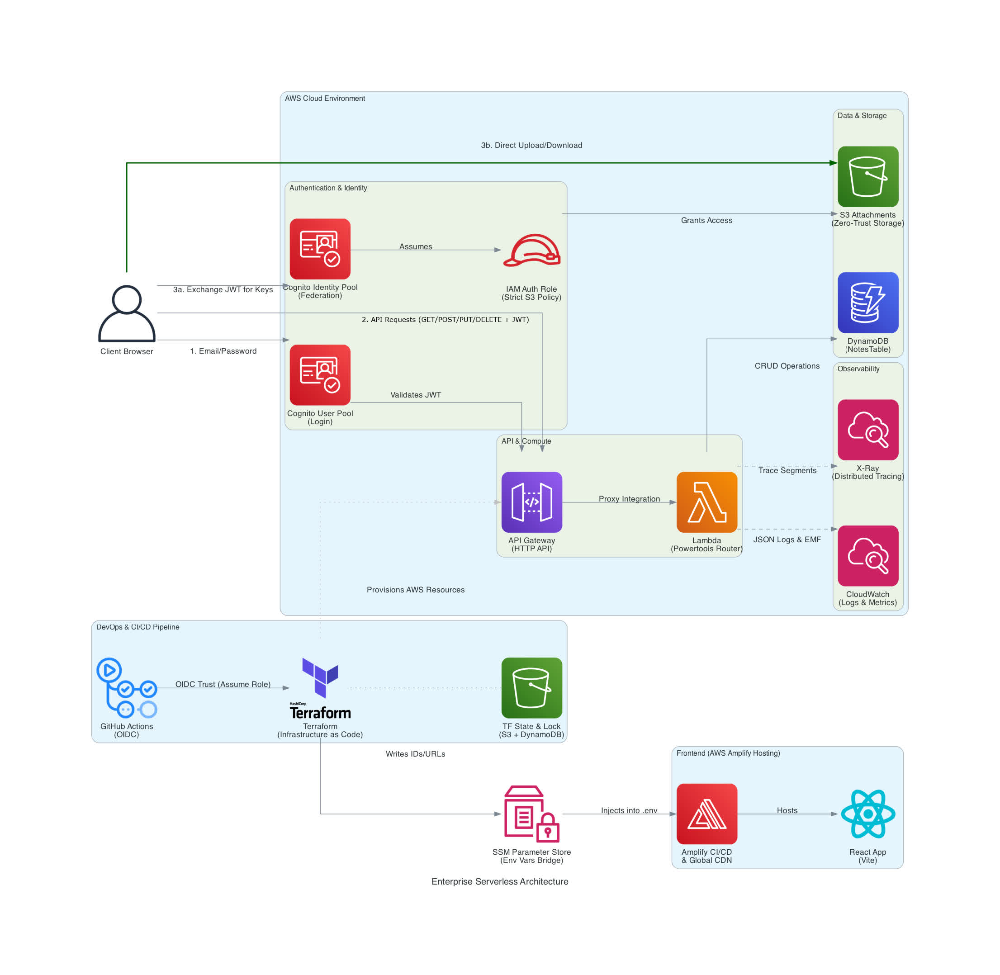

# Serverless Notes App (Enterprise Architecture)

A secure, fully serverless note-taking application built with React and AWS.

This project goes beyond a simple "Hello World" tutorial. It is built using strict enterprise best practices, including Infrastructure as Code (Terraform), Zero-Trust security, Direct-to-S3 file uploads, and a fully automated CI/CD pipeline.

## Architecture



## Tech Stack

**Frontend:**

- React (Vite)
- AWS Amplify SDK v6 (for Authentication and API requests)

**Backend & Storage:**

- **Compute:** AWS API Gateway & AWS Lambda (Python)
- **Database:** Amazon DynamoDB
- **Storage:** Amazon S3 (for image attachments)
- **Observability:** AWS X-Ray & Lambda Powertools (JSON logging & tracing)

**Security & CI/CD:**

- **Identity:** Amazon Cognito (User Pools & Identity Pools)
- **Infrastructure as Code:** Terraform
- **Automation:** GitHub Actions (OIDC) & AWS Amplify Hosting

---

## Features

- **Secure Authentication:** Users can sign up, log in, and reset passwords securely.
- **Full CRUD Operations:** Create, read, update, and delete personal notes.
- **Image Attachments:** Users can securely upload images to their notes.
- **Zero-Trust Data Isolation:** Users are mathematically locked into their own database partitions and S3 folders. No user can see another user's data.
- **Multi-Environment Setup:** Separated `dev` and `prod` environments to safely test new features without breaking the live app.

---

## Challenges Faced & How I Solved Them

- **OIDC Repo-Jacking Security Blocks:** When configuring passwordless CI/CD, AWS continuously rejected the GitHub Actions authentication request; I debugged the API calls using AWS CloudTrail and discovered GitHub's anti-repo-jacking numerical IDs, updating my IAM Trust Policy to match the exact mathematical signature to secure the pipeline.
- **Global Resource State Collisions:** Attempting to deploy an isolated `dev` workspace caused Terraform to crash when it tried to recreate global IAM resources (like the OIDC provider); I solved this by using conditional `count` logic to restrict global resources to production, and used `terraform state rm` and `import` to safely migrate state ownership without destroying live infrastructure.
- **API Gateway Payload Version Mismatches:** The AWS Lambda Powertools router crashed because Terraform defaults HTTP APIs to Payload Format Version 1.0, while the router expected 2.0; I fixed this by explicitly forcing `payload_format_version = "2.0"` in the Terraform integration and rewriting the Python token extraction to traverse the raw JSON event.
- **Production Environment Variable Syncing:** The React app crashed in production with a `Missing bucket name` error because the cloud build server couldn't read local Terraform outputs; I engineered an automated bridge by having Terraform write backend URLs to AWS SSM Parameter Store, and modifying the Amplify build script to fetch and inject them into a `.env` file dynamically during deployment.
- **Preventing Data Loss During Modularization:** Refactoring the Terraform monolith into reusable modules threatened to destroy the live database and Cognito user pool; I prevented this data loss by using `moved` blocks to surgically remap the resource addresses in the state file, achieving a seamless, zero-downtime architectural migration.

## How to Run Locally

If you want to run this project in a development sandbox:

1. **Deploy the Infrastructure:**

   ```bash
   # Switch to the development workspace
   terraform workspace select dev

   # Deploy the backend (This automatically generates a .env.local file for React!)
   terraform apply
   ```

2. **Run the Frontend:**

   ```bash
   cd serverless-frontend
   npm install
   npm run dev
   ```

   Open `localhost:5173` in your browser.

3. **Clean Up:**
   When you are done, destroy the resources so you don't get billed:
   ```bash
   terraform destroy
   ```
